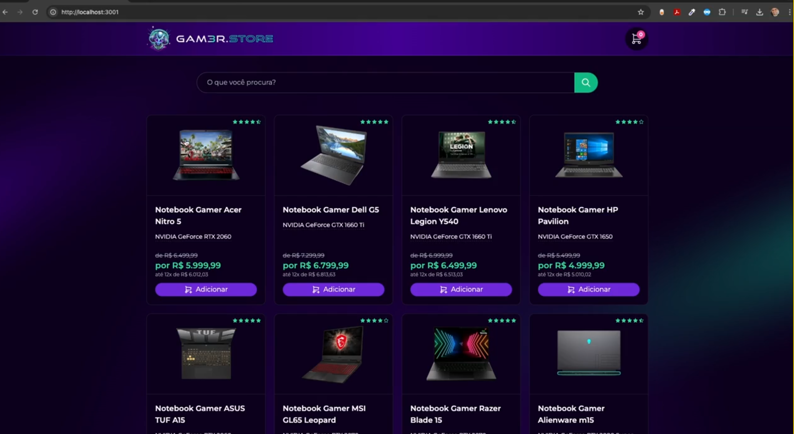
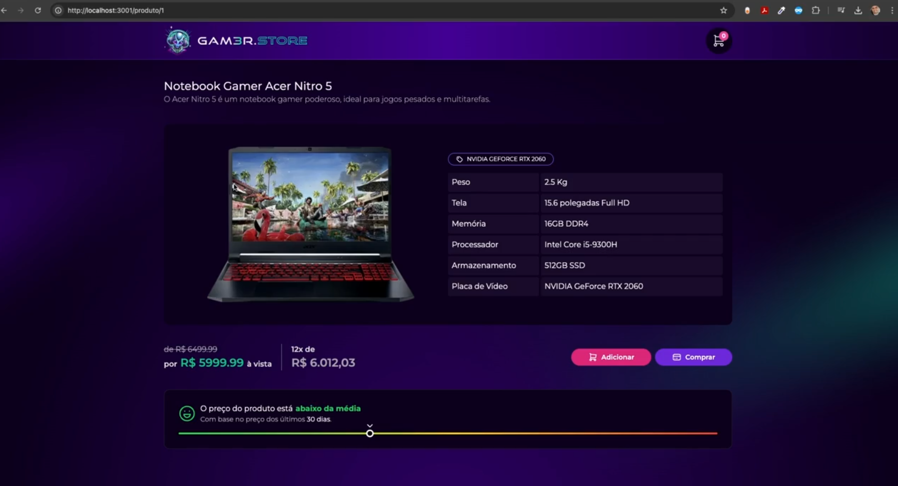

#### Projeto Base Aulas

123456

na pasta do backend

npm install prisma --save-dev

npx prisma init --datasource-provider sqlite

npx prisma migrate dev

criar o seed.ts dentro da pasta prisma

npx prisma db seed

```
import { PrismaClient } from "@prisma/client";
import { produtos } from "src/core";

const prisma = new PrismaClient();

async function seed(){
    await prisma.produto.createMany({
        data: produtos.map((produto) => ({
            ...produto,
            id: undefined,
        })),
    });
}

seed()
```

alterar o packege.json
"prisma":{
       "seed": "npx ts-node prisma/seed.ts"
}


observacao: npm i -D ts-node typescript @types/node

> Home


> Detalhes


#### Href.
```
https://escola.formacao.dev/especialista-dev/sala/gamer-store-iniciante?aula=97d04c11-7ae2-4618-8095-9f10ab41b59f
```

#### Dep
npm install @tabler/icons-react